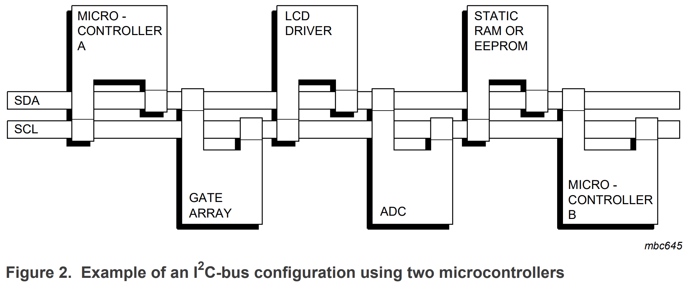
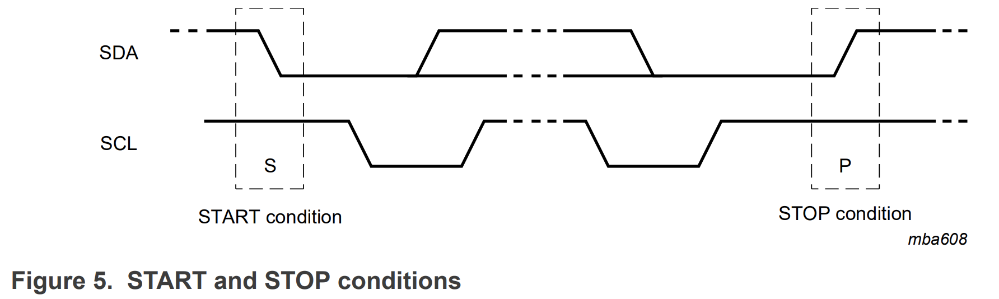
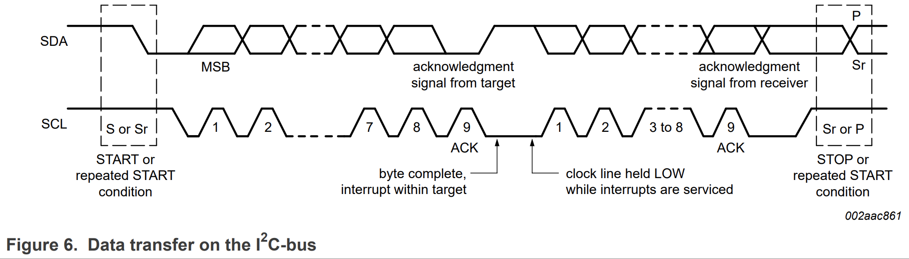

# I2C

I2C(Inter-Integrated Circuit)은 IC사이 통신 링크를 제공하는 양방향 2와이어 직렬 버스로이다. 2개의 선으로 직렬 통신을 하는 통신 프로토콜이다.하나의 마스터와 하나 이상의 슬레이브로 이루어져 있으며 이론적으로 슬레이브는 최대 127개까지 연결할 수 있다. SCL과 Data는 연결된 모든 Slave에게 전달이 되는데 해당 주소를 가진 디바이스만 응답하고 데이터를 주고 받는 형식으로 통신하게 된다.

Master에서 기준 클럭인 SCL을 생성하고, 이 클럭에 맞춰서 데이터를 SDA라인을 통해서 송신 및 수신을 하게 되는데 선이 하나 이므로 송신과 수신은 동시에 이뤄지지 않습니다. 즉 한 번에 송신만 하거나, 수신만 할 수 있는 반이중 통신 방식이다. I2C 사용시에 주의해야 할 점은 SDA선과 SCL선 모두 기본으로 High 상태가 되어야 하므로 풀업 저항을 달아야 한다.

- SDA : Data를 수신하거나 송신하는 선이다.
- SCL : Master에 의해 제공되는 clock 신호 선이다.

     

## 동작원리 

SDA와 SCL 풀업저항에 의해 기본 High로 SCA신호가 Low로 떨어질때가 시작신호라고 판단한다. 그 후에 SCL선으로 클럭 신호가 만들어지는데, 파란 부분처럼 클럭 신호가 Low 일때가 SDA신호를 비트 신호로 바꾸는 시간이고, 초록색 부분처럼 클럭 신호가 High 일때 SDA 신호을 읽는다. 한클럭당 한 비트 데이터 신호를 만들며, 모든 비트의 전송이 끝난 후 SCL 신호가 High가 되면 SDA신호 역시 High로 되어 정지신호를 만든다. 시작 신호 뒤에 나오는 첫 7비트는 슬레이브의 주소값이며 8번째 비트는 데이터를 읽어올지 또는 쓸지를 나타내는 신호 비트 이다.

     
     

 

#### References
https://www.nxp.com/docs/en/user-guide/UM10204.pdf