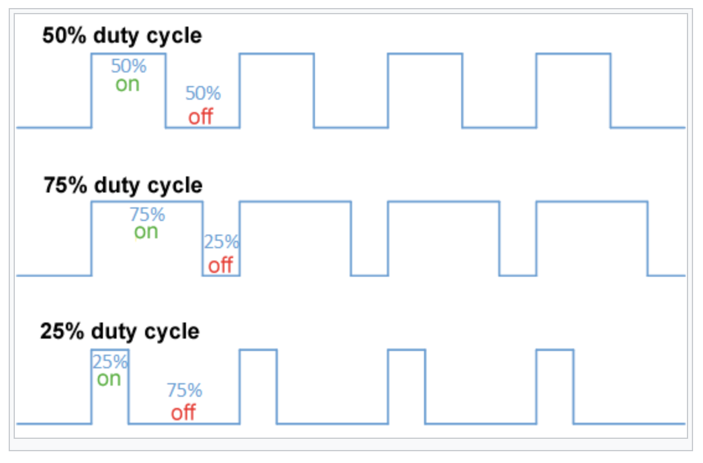

# PWM 

PWM 이란 Pulse Width Modulation의 약자로 말그대로 Pulse의 Width 길이를 가지고 값을 받는 형식이다. 이는 PDM(Pulse-Duration Module)이라고도 불린다. 전압값을 넘는 신호가 특정 주기(Duty Cycle)동안 얼마나 많은 비율을 차지하는가에 따라 값이 바뀌는 방식이다. 

    

- 제어 분야에서는 주로 모터 제어에 주로 사용된다. 
- 어떤 PWM 신호는 펄스의 주기와 펄스의 폭으로 정의
할 수 있다. 

<strong>Duty cycle = (pulse on time)/(pulse period) * 100 [%]</strong>

## 동작 원리

프로세서에서 타이머 모듈의 한가지 기능이 PWM 신호를 생성한다. 이후, PWM을 사용하기 위해서 Duty Cycle을 정하고 그 Duty Cycle 마다 일정한 주기만큼 High 신호를 보냄으로써 Pulse를 생성한다. Pulse의 길이가 Data의 값이 된다. High 시간을 보내는 시간을 제어하기위하여 timer 등을 사용하여야 한다.

#### References 
https://en.wikipedia.org/wiki/Pulse-width_modulation
