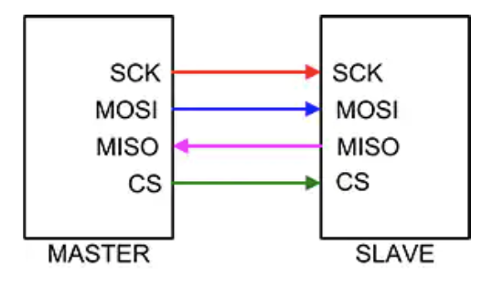
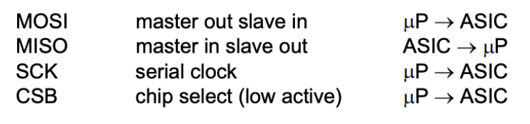
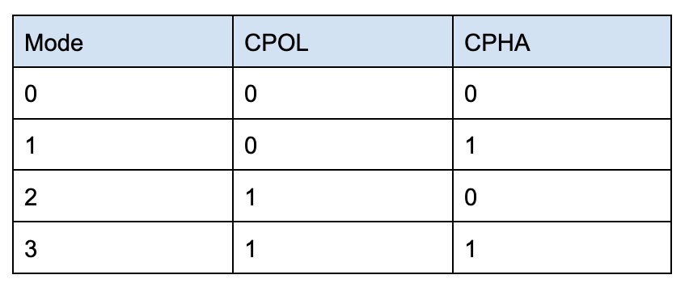
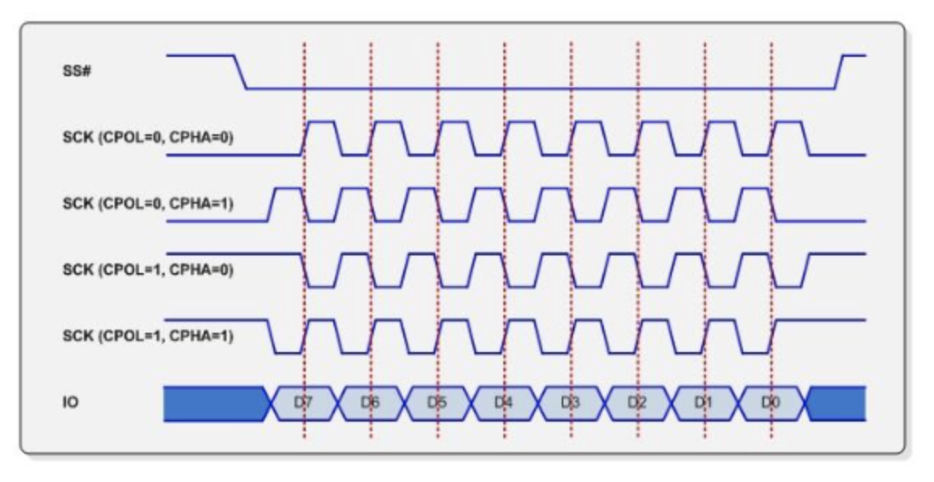

# SPI (Serial Peripheral Interface)  
  
SPI (Serial Peripheral Interface)는 하나의 Master와 하나 이상의 Slave 간의 통신을 위해 사용되는 방식이다. Master는 SPI 클럭을 제공하는 Micro-controller로 정의되고 Slave는 Master로부터 SPI Clock을 수신하는 모든 집적 회로로 정의된다. SPI에는 4-wire synchronous serial interface를 가지고 있다. 일반적으로 I2C 방식보다 빠르고, full duplex 방식으로 통신이 가능하다. 데이터 통신은 low active Slave Select 또는 Chip Select wire(CSB)를 통해 활성화된다. 데이터는 Serial Data Input(MOSI), Serial Data Output(MISO) 및 Serial Clock(SCK) 용 와이어로 구성된 3-wire interface를 통해 전송된다.

       
    <strong>UART Master & Slave Pins</strong>      
         

SPI Interface SPI Bus를 사용하는 모든 Micro-controller를 지원하도록 설계되었으며, 통신은 소프트웨어 또는 하드웨어 기반 SPI에 의해 수행될 수 있다.
    

## 동작원리 

Clock polarity (CPOL)과 clock phase (CPHA)가 Clock의 active edge를 결정한다. Master는 CPOL 값을 보고 동작을 결정하게 된다. CPOL 값이 0인 경우, 초기 신호 값이 Low이고, CPOL 값이 1인 경우, 초기 신호 값이 High이다. CPHA 값은 Clock이 default 상태에 있다가 언제 데이터를 읽을지 결정한다. CPHA 값이 0인 경우, 처음 Rising edge 또는 Falling edge가 발생할 때 데이터를 읽는 것이고, CPHA 값이 1인 경우, 두 번째 Rising edge 또는 Falling edge가 발생할 때 데이터를 읽는 것이다. 단, 데이터를 읽을 때, MSB를 먼저 읽게 된다. (보통 Mode (1, 4), Mode (2, 3) Pair로 지원하는 경우가 많다.)

        
         
    <strong>Rising & Falling Mode depending on CPOL & CPHA</strong>

