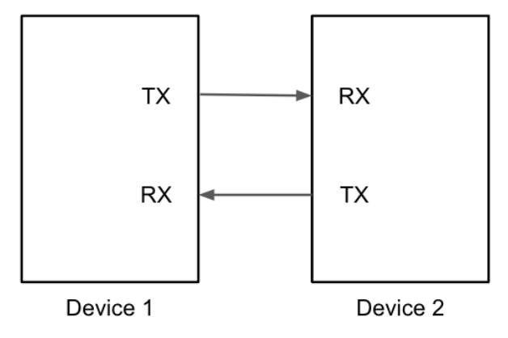
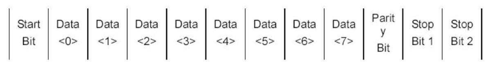

# UART

UART(Universal Asynchronous Receiver/Transmitter)는 두 장치 간에 직렬 데이터를 교환하기 위한 프로토콜이다. UART는 양방향으로 데이터를 송신 및 수신할 수 있는 full duplex뿐만 아니라 simplex와 half-duplex도 지원한다. 또한 송신기와 수신기 사이에 두 개의 와이어만 사용하므로 매우 간단하게 사용할 수 있다. UART는 별도의 Clock이 없기 때문에 전송된 신호를 읽을 속도를 정해줘서 읽어야 한다.

     

## 동작 원리

UART는 한번에 1byte의 데이터를 전송하고, 각 bit는 차례대로 전송된다. 송신기의 TX를 통해서 데이터 전송을 시작하면 Start Bit를 먼저 전송하고 데이터를 전송하게 된다. 데이터 전송이 끝나면 Parity Bit와 Stop Bit를 연이어 전송한다. 수신기는 RX로 들어온 Start Bit를 감지하고 8개 bit의 데이터를 받기 위해 bit의 개수를 센다. 데이터를 다 받으면 Parity Check Bit와 Stop Bit를 받고 통신이 완료된다.

    

