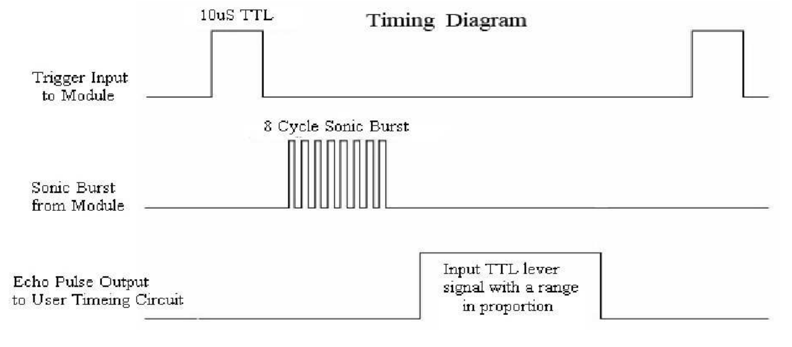

# Ultrasonic Sensor 

초음파 센서는 최소 10us 길이의 TRIG로 펄스 신호 전송하며, 초음파 모듈이 자동으로 8개의 40kHz 사각형을 전송합니다. 반사 신호가 있을 때 자동으로 감지되며, 반사 신호가 되돌아오면 ECHO는 high-level의 지속 시간이 초음파가 전달되어 돌아오기까지의 시간이 되는 Pulse를 출력합니다.

 
    

에코(Echo)는 Pulse이며 너비(Width)는 범위(Range)에 비례합니다.

공기 중의 온도 및 음속
- v = 331.3m/s + 0.606 * Tm/s/C (습도 0%의 경우)
- range [m] = high-level time [s] * velocity (340m/s) / 2;
- range [cm] = high-level time [us] * 0.017;

에코 신호에 대한 트리거 신호를 방지하려면 60ms 이상의 측정 사이클을 사용할 것을 권장하며, 보통 초당 10회 정도 측정합니다.

#### References
https://cdn.sparkfun.com/datasheets/Sensors/Proximity/HCSR04.pdf